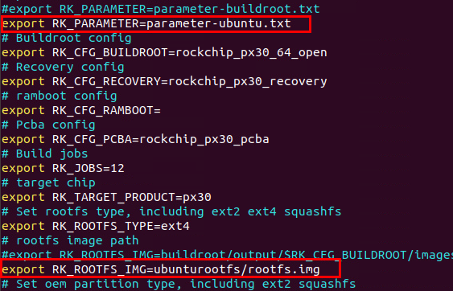

title: How to Build Ubuntu
---

The procedure to describes how to create Ubuntu Root File System(RFS) image on **LEC-PX30 with Industrial Pi-SMARC**


## **Prerequisites**

1. Install QEMU on the development host PC with Ubuntu OS

   ```
   $ sudo apt-get install qemu-user-static
   ```

2. Download Ubuntu 18.04 base from http://cdimage.ubuntu.com/ubuntu-base/releases/18.04/release/   and choose this one: `ubuntu-base-18.04.1-base-arm64.tar.gz`

3. Create a temporary folder for decompression after download.

   ```
   $ mkdir temp
   $ sudo tar -xpf ubuntu-base-18.04.1-base-arm64.tar.gz -C temp
   ```


## Configure the rootfs

1. Get your network ready:

   ```
   $ sudo cp -b /etc/resolv.conf temp/etc/resolv.conf
   ```

2. Prepare QEMU:

   ```
   $ sudo cp /usr/bin/qemu-aarch64-static temp/usr/bin/
   ```

3. Change root:

   ```
   $ sudo chroot temp
   ```

4. Update and upgrade:

   ```
   $ apt update
   $ apt upgrade
   ```

5. Install the required tools or utilities:

   ```
   $ apt install vim git sudo net-tools ifupdown kmod iputils-ping man wget bash-completion alsa-utils apt-utils usbutils locales i2c-tools netplan.io vnc4server lm-sensors usbmount build-essential cmake can-utils sox v4l-utils xubuntu-desktop candump vim
   ```

6. Add user name:

   ```
   $ useradd -s '/bin/bash' -m -G adm,sudo adlink
   ```

8. Set user’s password:

   ```
   $ passwd adlink
   ```

9. Set the root user’s password:

   ```
   $ passwd root
   ```

10. Add host name to `/etc/hostname`

       ```
    $ echo 'adlink' > /etc/hostname
       ```
    
11. Add host entry in `/etc/hosts`

       ```
    127.0.0.1 localhost
    127.0.0.1 adlink
       ```

12. After all the work is done, exit.

    ```
    $ exit
    ```


## Add I/O Interfaces to rootfs 


###    Ethernet & CAN Bus

1. Create a directory to copy the Ethernet and CAN kernel modules

    ```
    $ sudo mkdir temp/home/adlink/rockchip_test
    ```
    
2. Please click [here](https://hq0epm0west0us0storage.blob.core.windows.net/public/LEC-PX30/documentation/px30-ubuntu-kernel-module_20191226.zip) to download and copy  **smsc9500.ko,  smscusbnet.ko and mcp25xxfd.ko kernel modules** anto rockchip_test folder from host PC. 

    ```
    $ sudo cp /your path/*.ko temp/home/adlink/rockchip_test
    ```

3. Suggest to use Netplan to enables easily configuring networking on system. Please create a `01-network-manager-all.yaml` file under /etc/netplan

    ```
    $ sudo vim temp/etc/netplan/01-network-manager-all.yaml
    ```

    and add the followin content, then save it.
    
    ```
    network:
      version: 2
      renderer: networkd
      ethernets:
        eth0:
          dhcp4: true
          optional: true
        enx00800f117000:
          dhcp4: true
          optional: true
    ```

  

###    Audio

1. Please click here to download **asound.state** file and copy to `/var/lib/alsa/`

   ```
   $ sudo cp asound.state temp/var/lib/alsa/
   ```


### Enable I/O Interfaces 

1. Please click [here](https://hq0epm0west0us0storage.blob.core.windows.net/public/LEC-PX30/documentation/px30-ubuntu-configuration_20191226.zip) to dowloand and copy **Load.sh** file to the `rockchip_test`folder. 

   **Note**: it is shell script to insert modules on every reboot 

   ```
   $ sudo cp temp/home/adlink/rockchip_test/Load.sh
   ```

2. Give execute permissions to script
   ```
   $ sudo chmod +x temp/home/adlink/rockchip_test/Load.sh
   ```

3. Copy **rc.local** to `temp/etc/` 

   ```
   $ sudo cp rc.local temp/etc/
   ```

4. Give executable permissions.
   ```
   $ sudo chmod +x temp/etc/rc.local
   ```


## Make the Root File System

Execute the commands below to make the rootfs. Notice that you need change the “count” value according to the size of the “temp” folder.

Below command will create new rootfs.img file of size 7.4 GB (6.9 GB)

    $ dd if=/dev/zero of=rootfs.img bs=1M count=7065 status=progress && sync
    $ sudo mkfs.ext4 rootfs.img
    $ mkdir rootfs
    $ sudo mount rootfs.img rootfs
    $ sudo cp -rfp temp/* rootfs/
    $ sudo umount rootfs/
    $ e2fsck -p -f rootfs.img

 The final root files system rootfs.img is ready.


## Add the created rootfs to Buildroot 

The procedure to describes how to bind Ubuntu rootfs image to LEC-PX30 Buildroot Linux

1. Download [LEC-PX30 Buildroot SDK](https://hq0epm0west0us0storage.blob.core.windows.net/development/LEC-PX30/SDK/px30_buildroot_es2_sdk_20191218.tar.gz) and extract it.

   ​    **Note**: kernel branch is `iPIsmarc-es2`  and use `root` account for the building.

2. Change directory to px30_buildroot.

   ```
   $ cd px30_buildroot
   ```

3. Create a temporary directory.

   ```
   $ mkdir ubunturootfs
   ```

4. Copy the created rootfs.img to ubunturootfs.

   ```
   $ cp /your path/rootfs.img ubunturootfs
   ```

5. Create a parameter-ubuntu.txt file under device/rockchip/px30 folder.

   ```
   $ cp device/rockchip/px30/parameter-buildroot.txt device/rockchip/px30/parameter-ubuntu.txt
   ```

6. Change directory to ubunturootfs folder and to check UUID of rootfs image by running below command

   ```
   $ file ubunturootfs/rootfs.img
   ```

​        and you will see the UUID as the below


7. Modify UUID you have to`parameter-ubuntu.txt` file

   ```
   $ vi device/rockchip/px30/parameter-ubuntu.txt
   ```


​          then, modify the rootfs size and alter the user data starting address as per requirment. In below we      are changing rootfs szie to 7GB.


8. Open BoardConfig_open.mk file and change the path for `parameter-ubuntu.txt` and `rootfs.img` files.

   ```
   $ sudo vi device/rockchip/px30/BoardConfig_open.mk
   ```



9. Open rk3326.dtsi file and add new part UUID or device partition. In below added /dev/mmcblk1p8 partition.

   ```
   $ sudo vi kernel/arch/arm64/boot/dts/rockchip/rk3326-linux.dtsi
   ```


10. Change directory to `px30_buildroot`

       ```
      $ cd px30_buildroot
       ```


11. Run build.sh, it will generate update.img under rockdev folder.

       ```
      $ ./build.sh
       ```

